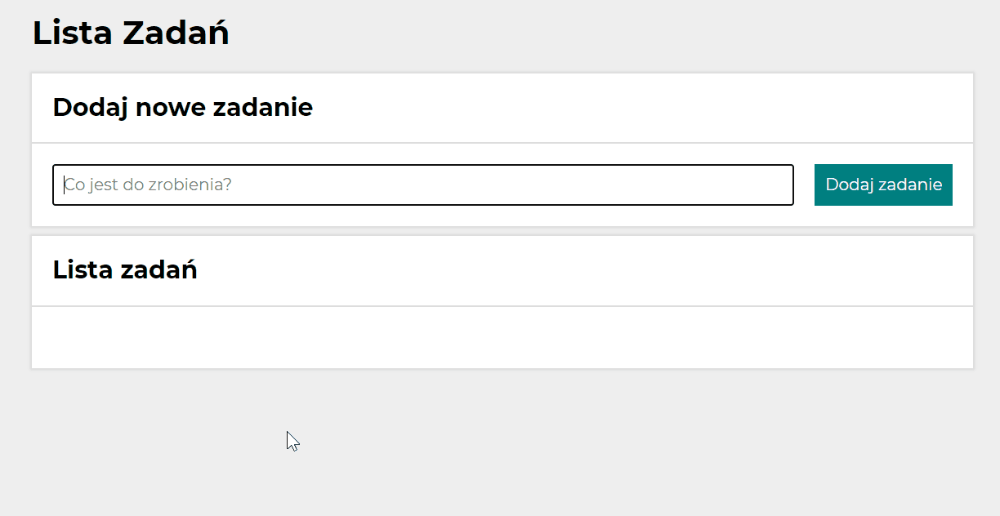
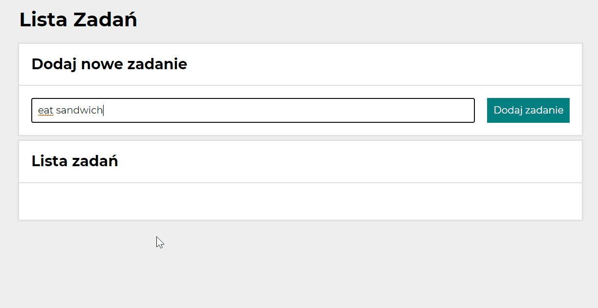
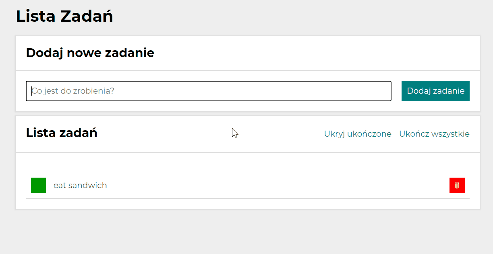
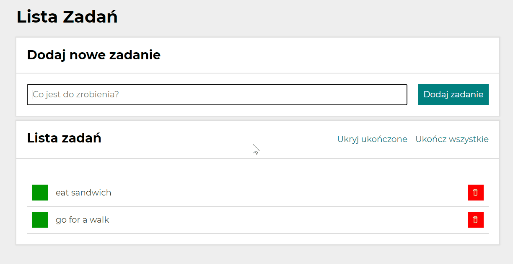
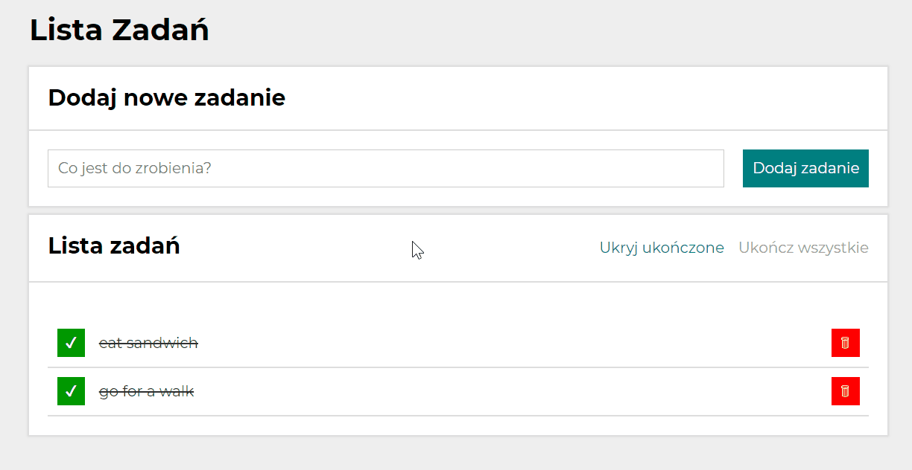

# To Do List App
## Demo
https://pawlo1994.github.io/to-do-list

## Used Technologies
1. HTML
2. CSS
3. JavaScript with ES6+
4. BEM
5. Grid
6. Flexbox

## Description
Simple To Do List App.

## How to use
1. Type your task content in field which is in "Dodaj nowe zadanie" section.

2. Then click on "Dodaj zadanie" button to add your task.

3. If your task is done, you can click on green button which is next to your task text.

4. If you want to delete your task, click on red button with trash.

5. If you want to done all tasks, click on "ukończ wszystkie" button.

6. If you want to hide done tasks, click on "ukryj ukończone". If you want to show them again, click on "pokaż ukończone".
